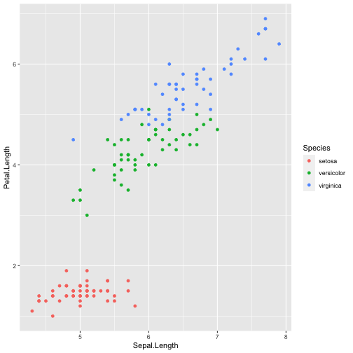

Developing Data Products Week 4
========================================================
author: Manfred Herdt
date: 20.02.2021
autosize: true

Coursera Reproducible Pitch
========================================================

This is final task of the Developing Data Products Week 4 Course. For this Task i have created a shiny app and deployed it on the shiny server. You can access the app via <https://mherdt1992.shinyapps.io/developingdataproductsweek4/>. And the source code can be found on github as well <>.

Overview
========================================================

The goal of this app is to analyze the iris data set. Here is an extract of the dataset.


```r
library(shiny)
library(ggplot2)
library(dplyr)
head(iris)
```

```
  Sepal.Length Sepal.Width Petal.Length Petal.Width Species
1          5.1         3.5          1.4         0.2  setosa
2          4.9         3.0          1.4         0.2  setosa
3          4.7         3.2          1.3         0.2  setosa
4          4.6         3.1          1.5         0.2  setosa
5          5.0         3.6          1.4         0.2  setosa
6          5.4         3.9          1.7         0.4  setosa
```

The App Output
========================================================

Here is an example what the Output of the App look like. You can choose the Input Varaibles and analyze the data.




The UI Code
========================================================

Here is the UI Code


```r
ui <- fluidPage(

    # Application title
    titlePanel("Iris Data Analysis"),

    # Sidebar with a slider input for number of bins 
    sidebarLayout(
        sidebarPanel(fluid = FALSE,
            selectInput("Variable1","Variable 1:",
                        c("Sepal.Length", "Sepal.Width",  "Petal.Length", "Petal.Width")
                        ),
            selectInput("Variable2","Variable 2:",
                        c("Sepal.Length", "Sepal.Width",  "Petal.Length", "Petal.Width")
            ),
            out = h5("use the input selector for visual data analysis")
        ),

        # Show a plot of the generated distribution
        mainPanel(
           plotOutput("irisPlot")
          
        )
    )
)
```

The Server Code
========================================================

Here is the Server Code


```r
server <- function(input, output) {

    output$irisPlot <- renderPlot({
        # generate bins based on input$bins from ui.R
        iris %>% ggplot(aes(x = get(input$Variable1) , y = get(input$Variable2), color = Species))+geom_point() 
    })
}

# Run the App
#shinyApp(ui = ui, server = server)
```


